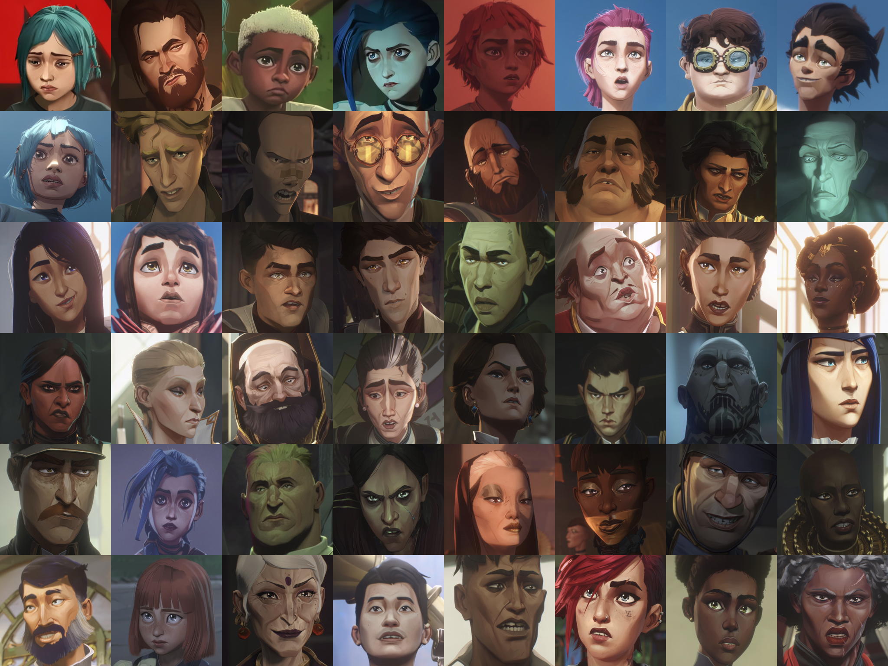
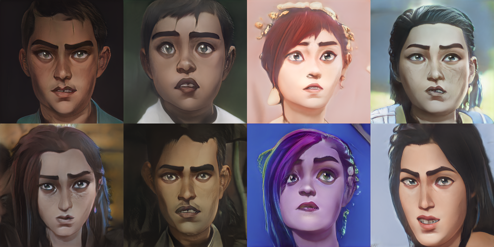
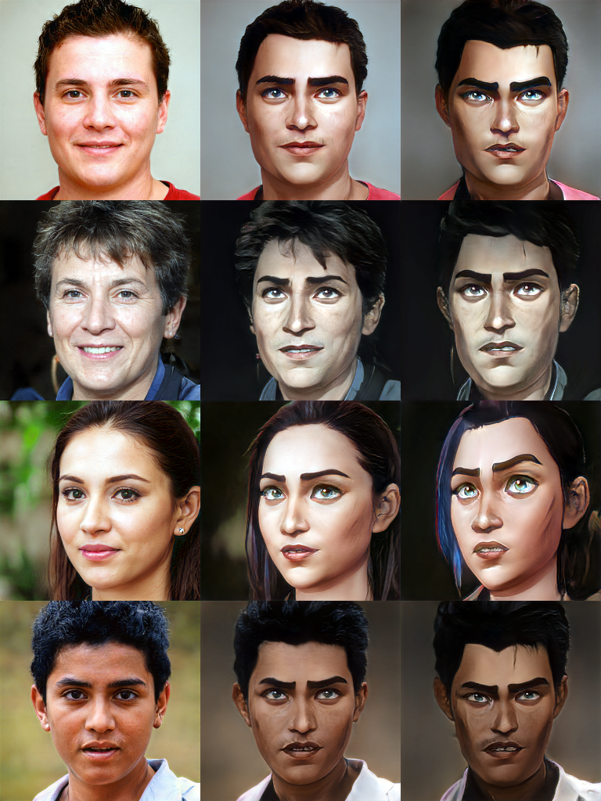

# ArcaneFaces
A handcrafted high-quality dataset of over 3400 faces from Arcane.

Download the dataset [here](https://drive.google.com/file/d/1yu9tF9sJ_aZCFt2Bvdi819-uiqT5zRKL/view?usp=sharing) (Google Drive).

## Dataset overview

This dataset contains 3411 .png images of **human** faces taken from frames of all 9 episodes, as well as the music video Enemy by Imagine Dragons. The faces in this dataset are blur-free and capture many characters (**NOTE: Silco and some other characters with significant face deformities are not included**). Keep in mind, however, that this dataset is far from balanced, since main characters like Vi, Caitlyn, Jinx/Powder, and Jayce appear far more often than others.

Below are the characteristics of the dataset:

|   | Height | Width | Aspect Ratio
| ------------- | ------------- | ------------- | ------------- |
| mean | 675.4 | 731.7 | 1.087 |
| std | 198.3 | 228.3 | 0.054 |
| min | 184 | 185 | 1.000 |
| 10% | 399 | 426 | 1.016 |
| 20% | 488 | 513 | 1.034 |
| 30% | 563 | 598 | 1.050 |
| 40% | 625 | 667 | 1.065 |
| 50% | 679 | 729 | 1.081 |
| 60% | 734 | 788 | 1.098 |
| 70% | 792 | 860 | 1.116 |
| 80% | 862 | 936 | 1.137 |
| 90% | 942 | 1044 | 1.164 |
| max | 1081 | 1272 | 1.219 |

## Dataset Usage Examples

You can use this dataset in various ways, like generating your own Arcane characters via a fine-tuned StyleGAN2:

Or you can create your own paired dataset via StyleGAN2 Blending to train your own Arcane image translation models:

## Issues and Suggestions
If you encounter any problems with the dataset, or have suggestions for its improvement, feel free to open an issue!
